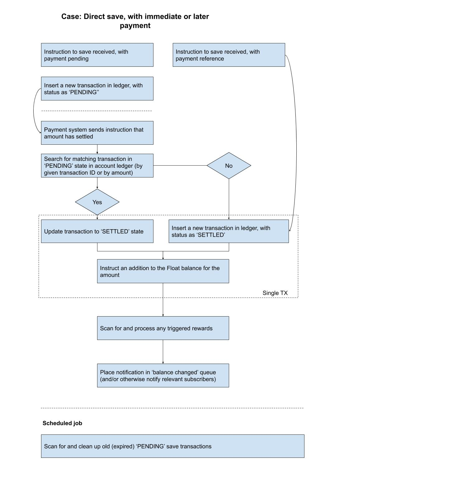

# User action lambdas (saving, balance query, withdrawal, etc)

## Saving

Comes in two varieties: either the user has paid during the save (e.g., with a credit card), or the user has saved but we are 
still waiting for the payment to settle (e.g., from an ETF). The relevant flows are then as follows:

